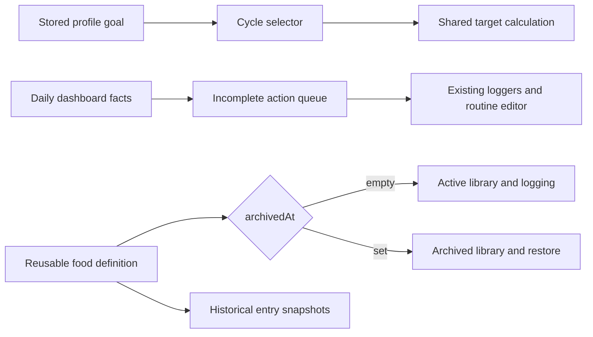

## Context

The profile already stores four goal values: two loss intensities, maintenance, and gentle gain. Target calculations are pure and shared by onboarding, Settings, local/demo dashboards, and the Worker. Today already receives today’s food entries, water entries, active medication routines and check-ins, plus the latest weight. Reusable foods are stored in local state or D1 and are currently permanently deleted. See `proposal.md` for motivation and the delta specs for observable behavior.

The UI work is a preserve-mode refinement in Operate mode. `PRODUCT.md` and `DESIGN.md` remain authoritative: one-handed logging, calm botanical surfaces, neutral progress language, 44px targets, safe responsive behavior, and no medical or guaranteed body-composition claims.

## Goals / Non-Goals

**Goals:**

- Build cycle language on the current goal model so existing profiles and calculation tests remain valid.
- Derive daily action visibility from already persisted daily facts rather than introducing a second checklist store.
- Make food archive state consistent across local, demo, offline-capable client paths, and private D1 storage.
- Improve hierarchy and interaction feedback without replacing the visual system or hiding existing repeated-log controls.
- Repair the mobile navigation topology and extend existing Progress analytics without adding new history requests.

**Non-Goals:**

- Cycle history, scheduled cycle transitions, coaching, deadlines, automatic weight-rate changes, supplement dosage, or medical adherence advice.
- Treating one food or water entry as completion of a nutrition or hydration target; it only completes the top prompt.
- Executing a D1 migration, deploying, changing authentication, or adding a production dependency.

## Decisions

1. **Represent cycles as a presentation layer over the existing goal values.** Cut maps to the existing gentle/steady loss values, Gain maps to gentle gain, and Recomposition maps to maintenance. This preserves stored values, automatic maintenance factors, and rollback compatibility. Replacing the database enum-like text with new values would add migration and validation risk without improving the user-visible behavior.

2. **Keep the manual calorie range profile-wide.** Switching cycle changes automatic calorie and protein guidance, but an existing manual range stays in effect and is labelled as an override. Per-cycle saved manual presets are deferred because they add a new nested persistence model the request does not require.

3. **Compute an ephemeral daily-action queue from dashboard facts.** Food and water are complete when their daily arrays are non-empty; weight is complete when the latest weight timestamp falls inside the dashboard’s local date; creatine is complete when a case-insensitive active routine named “Creatine” has a check-in for that date. The queue has no independent persistence and therefore cannot drift from the journal.

4. **Keep repeated logging outside the disappearing queue.** The existing food launchpad and water panel remain available after their top prompts disappear. Completing or undoing a record recomputes the queue, with a polite live-region announcement and deterministic focus transfer so the disappearing control does not strand keyboard focus.

5. **Reuse medication routines for creatine.** A missing routine opens the existing editor with name “Creatine” and schedule “Either”; it is not silently created or checked in. This avoids a second supplement data model and retains the current privacy and daily-check-in behavior. Other medication routines remain supported and are not relabelled as creatine.

6. **Add nullable `archivedAt` to reusable foods and query by lifecycle.** Active dashboard and search queries exclude archived rows. The Foods page uses a lifecycle-filtered library query so Archived can list and restore definitions that Today intentionally does not receive. Archive and restore are PATCH operations suitable for local/demo parity; the existing DELETE path remains permanent and is only exposed from Archived with confirmation.

7. **Preserve historical snapshots and references.** Archiving does not rewrite food entries or null their food ids. Permanent deletion keeps the current behavior of detaching reusable definitions while leaving entry snapshots intact. Editors encountering an archived or deleted definition fall back to the existing direct-entry recovery path.

8. **Use one compact, responsive action band as the visual focal point.** At phone width it is a two-column grid of clear icon-and-label buttons; at 320px or high zoom it becomes one column, and at wider widths it remains bounded rather than stretching across the dashboard. Completed items exit with a reduced-motion-safe crossfade; all-done becomes a quiet text status, not a streak or celebration card. Foods and cycle controls reuse current card radii, tokens, and typography with stronger grouping rather than new decoration.

9. **Extend the existing bounded Progress summary.** Calculate fibre averages from the same food-logged-day denominator already used for calorie and protein averages, derive signed weight change from the first and last check-ins in the selected response, and display the active cycle plus logged-day sample. This reuses current 7/30-day requests and avoids parallel analytics cards that repeat the detailed coverage and food-pattern sections below.

10. **Match the bottom navigation grid to its four rendered destinations.** Use four equal columns and keep the shared safe-area clearance tokens for page content, sheets, and toasts. The prior five-column declaration was left behind after Insights merged into Progress and visibly compresses the four remaining tabs.

## Risks / Trade-offs

- **A routine named with extra wording such as “Creatine monohydrate” is not an exact match** → Normalize case and whitespace and accept names beginning with “creatine”; document this in focused helper tests.
- **A disappearing CTA can cause visual or focus disruption** → Announce completion, move focus to the next incomplete action or section heading, and disable transforms under reduced motion.
- **The latest weight may come from another timezone boundary** → Compare its timestamp using the dashboard timezone/date rather than the browser’s default formatting.
- **Archived foods could return through stale cache/offline state** → Normalize missing archive fields to null, filter at the adapter and UI boundaries, and invalidate dashboard/library caches after archive or restore.
- **The active dashboard currently limits cloud foods** → Use the dedicated lifecycle-filtered foods endpoint for complete library management while retaining a bounded active set on Today.
- **More summary metrics can make Trends noisy** → Keep six compact, equally structured metrics above detailed charts and disclose the logged-day denominator once in the cycle context row.

## Migration Plan

1. Add a nullable `archived_at` column and active/archive lookup index in a new backward-compatible D1 migration file.
2. Normalize legacy local/demo foods to `archivedAt: null`; no destructive local-state rewrite is required.
3. Ship code only after the migration is explicitly approved and applied by the owner; no migration or deployment is performed as part of implementation.
4. Rollback can restore the prior client and Worker because existing rows remain valid and the nullable column is ignored by old code. Archived foods would become visible under old code, but no food or entry data would be lost.
