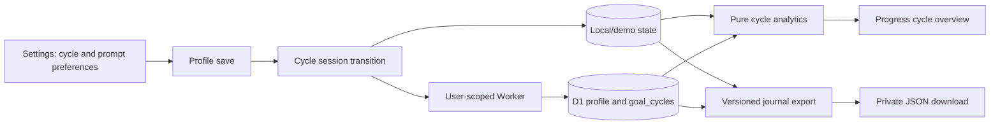

## Context

The current journal stores one legacy goal value on the profile, timestamped log records, and optional user-scoped D1 equivalents. Local state is versioned and cloud writes use explicit per-user Worker routes. The active `add-cycle-goals-daily-actions-food-archive` change already maps legacy goals to three top-level cycles and introduces four incomplete-only Today actions; this change builds on that behavior without rewriting historical entry snapshots. See `proposal.md` and the capability specs for the new contract.

## Goals / Non-Goals

**Goals:**

- Preserve a truthful lifecycle for goal cycles across local, demo, and cloud journals.
- Make corrections and backup available without slowing the normal one-tap logging path.
- Turn existing history into a decision-oriented, inspectable cycle summary.
- Keep every cloud query user-scoped and every migration backward compatible.

**Non-Goals:**

- No cycle forecasting, invented ETA, medical assessment, dosage tracking, cloud file storage, automatic coaching, data import/replace, or retrospective claim that old entries belonged to a newly created cycle.
- No drag-only interaction; prompt ordering must work with explicit move controls and keyboard focus.
- No remote migration, deployment, credential change, new dependency, or production mutation in this implementation.

## Decisions

### Store explicit cycle sessions alongside the profile

Add a `goal_cycles` collection/table containing an id, owner, top-level cycle, stored goal variant, local `start_on`, nullable `end_on`, and calorie/protein plan snapshot. One open row is active. Profile save detects top-level cycle changes: it closes the active session and creates the next session; intensity or target changes update the active snapshot.

This is preferred over reconstructing cycles from profile changes because no such audit trail exists, and over tagging every journal row because date bounds preserve immutable food/water/weight records and keep writes fast.

### Lazily seed legacy journals without fictional backfill

Local/demo normalization and cloud bootstrap create an active session on the current local date only when none exists. The owner can backdate that first session through Settings. Existing entries remain available globally but do not silently become part of a cycle until its explicit start date includes them.

### Persist daily prompts as a compact ordered profile preference

Extend the profile with `dailyActionOrder` containing all four stable keys and `dailyActionHidden` containing disabled keys. Local normalization repairs missing, duplicate, or unknown keys; D1 stores the two lists as comma-separated validated values. Explicit Up/Down and Show/Hide controls avoid an inaccessible drag dependency.

This is preferred over a separate preferences table because the data is tiny, profile-scoped, and always needed with Today bootstrap.

### Correct records through idempotent user-scoped mutations

Add PATCH routes for water and weight plus DELETE for weight. Local/demo adapters replace or remove only the matching id; cloud SQL includes both `id` and `user_id`. Offline writes carry optimistic replacements/removals and invalidate the affected dashboard/history caches. Food and medication corrections continue through their established paths.

### Compute cycle analytics from one bounded cycle payload

Add a cycle-history response containing the active session, optional previous session, daily nutrition aggregates, and weight rows for their exact date bounds, capped at 366 days per session. A pure helper calculates:

- inclusive elapsed days and food-logged-day coverage;
- calories/protein averaged only across food-logged days;
- target deltas from the session plan snapshot;
- measured first-to-last weight change;
- least-squares weight slope in kg/day multiplied by seven when at least two check-ins span seven days;
- `insufficient_data`, `on_track`, or `review_target` from published sample and signal rules.

`on_track` requires sufficient intake and weight samples plus intake within the saved range and a weight direction consistent with the selected cycle (Cut non-positive, Gain non-negative, Recomposition within ±0.25 kg/week). `review_target` requires sufficient samples and both an out-of-range intake average and a conflicting weight direction. Mixed or incomplete signals remain `insufficient_data`; the UI shows these rules and never infers a health outcome.

### Generate one sanitized JSON backup at the data boundary

Define a versioned `JournalExport` type. Local/demo export reads normalized durable state; cloud export uses one authenticated Worker route and user-scoped queries inside a consistent request. The client serializes the returned contract into a Blob download. Queue metadata, caches, auth session fields, and provider data never enter the contract.

This is preferred over multiple CSVs because nested profile, definition, and session data need one lossless backup. Import remains out of scope until conflict, validation, and destructive-recovery semantics are separately designed.

### Preserve the current visual system and disclose complexity

Settings gains two existing-pattern disclosures: Cycle history and Daily prompts/Data backup. Today changes only prompt ordering/filtering. Progress adds one cycle overview before existing bounded trends, with sparse and comparison states. Correction editors reuse the current bottom-sheet/form patterns rather than adding a parallel interaction language.

### Snapshot food context and reject expired timing signals

Saved foods and food-entry snapshots gain a compact `foodKind` enum plus normalized private labels. Direct logs expose the same fields, so analytics can later distinguish whole foods, prepared meals, packaged foods, and supplements without guessing from names. Existing rows normalize to `prepared` with no labels; no historical classification is invented beyond that neutral default.

Exercise guidance evaluates each qualifying carb entry against its own computed window, ignores entries under 10 g carbohydrate, and rejects windows whose end is already past. The result includes an `upcoming` or `active` phase so Today can say `Now` instead of showing a past start time. The mobile nav becomes a solid bottom-edge surface; the library reduces technical ratio sorts to four legible owner choices.

## Risks / Trade-offs

- **Cycle start dates can overlap or create misleading comparisons** → validate against the previous end date and today, show exact date bounds, and never infer an unrecorded earlier start.
- **Least-squares rate can overstate a tiny sample** → require two weights spanning seven days, show sample size, and label it measured rather than predicted.
- **Cloud export can become large** → cap cycle analytics queries but keep export complete; stream JSON from the Worker only if real usage proves response size problematic.
- **Queued corrections can race with another device** → use id-based last-write behavior already established by offline writes and reload authoritative state after sync.
- **Profile list fields can drift** → normalize against the four known action keys at every boundary and test legacy, duplicate, and unknown values.
- **The new D1 schema is not active until migration** → local mode remains testable; authenticated behavior is code-complete but must not be claimed live before the migration and deployment are explicitly approved.

## Migration Plan

1. Add but do not apply `0004_cycle_history_and_data_control.sql` after the existing unapplied food-archive migration.
2. Ship code only after the migration is applied in the target environment through a separately approved release workflow.
3. Bootstrap missing cycle sessions lazily so existing profiles do not require a destructive data rewrite.
4. Rollback application code by ignoring the additive columns/table; do not drop user rows as part of rollback.
