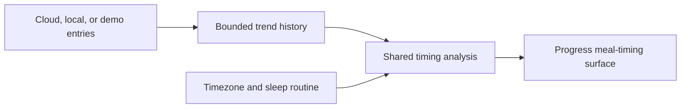

## Context

Progress currently receives daily nutrition totals and weight history for a
bounded 7-day or 30-day range. The Worker and local journal already fetch the
underlying food entries to build those totals, but discard the entry-level
timestamps before returning the response. Demo history synthesizes only daily
totals.

The feature must behave the same in cloud, local, and demo modes, respect the
browser's timezone, stay useful on a 390 px phone, and describe observations
without implying that meal timing caused a health or weight outcome.

## Goals / Non-Goals

**Goals:**

- Reuse existing timestamps and nutrients without collecting new information.
- Produce one shared, deterministic analysis across every storage mode.
- Exclude unlogged days from averages and expose the sample size.
- Make the first/last food rhythm and calorie distribution scannable.
- Preserve the existing Progress hierarchy, language, and responsive behavior.

**Non-Goals:**

- AI-written recommendations or opaque scoring.
- Causal claims involving weight, sleep quality, exercise, or health.
- Meal labels, hunger ratings, glucose data, or workout completion.
- Long-term statistical significance or a new database table.

## Decisions

### Return bounded entries only for trend history

`HistoryResponse` gains optional `entries`. The 7-day and 30-day trend paths
populate it; calendar responses omit it because the selected-day calendar does
not need entry-level analysis. The Worker already loads these rows for daily
totals, so this adds response data without another query.

An alternative was to calculate analytics only on the Worker. That would
duplicate behavior in local and demo modes and make the calculation harder to
test as one product rule.

### Analyze entries in one pure helper

A shared `analyzeMealTiming` helper groups entries by local date using the
selected timezone. It calculates:

- circular-average first and last food times;
- mean eating-window duration across days with at least two entries;
- calorie and protein shares before noon, from noon to 5 pm, and after 5 pm;
- the most frequently logged food and its circular-average logged time;
- days whose last entry falls within two clock hours of the saved sleep routine.

Circular clock averages avoid treating 23:45 and 00:15 as twelve hours apart.
Unlogged days never enter the denominator. Results always include logged-day
and entry counts.

An alternative was to infer breakfast, lunch, and dinner. The journal does not
store meal labels, so fixed, visibly named time bands are more honest.

### Present one analytical story, not another metric grid

The existing botanical Progress language is preserved. A single “Meal timing”
surface combines a first-to-last timeline, three divided facts, and a compact
time-band distribution. It appears after the period summary and before daily
calories so the page moves from overview, to timing, to day-by-day intake.

The sparse state asks for a second logged day. The footer states that missing
days are excluded and patterns are not cause-and-effect.

## Risks / Trade-offs

- **Large 30-day journals increase response size** → Return only the already
  bounded trend entries and omit them from calendar requests.
- **Midnight-adjacent times can distort averages** → Use circular clock means
  and timezone-aware date grouping.
- **Sparse logging can look more representative than it is** → Show sample
  counts, exclude missing days, and require two logged days for the full view.
- **Sleep proximity can sound like advice** → Show the inferred sleep time,
  state that the two-hour comparison works in either direction, and avoid
  good/bad language.
- **Food names can vary by spelling** → Group case-insensitively while
  preserving the most recent display name.

## Migration Plan

Deploy the Worker and client together. The response addition is backward
compatible and requires no stored-data migration. Rollback is the previous
Worker version; clients already tolerate missing optional `entries`.

## Open Questions

None for the first version. Weight correlation remains intentionally deferred
until the owner has seen the deterministic timing surface.
