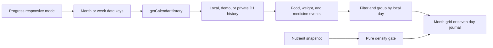

## Context

See [proposal.md](./proposal.md) for motivation. Progress currently owns month navigation and requests the 42 local date keys produced by `calendarGrid`. `HistoryCalendar` renders that month plus a selected-day detail containing chronological entries. The local and demo stores already contain medication check-ins, while the authenticated journal keeps them in D1 with the medicine name in the related medication row. Weekly review therefore needs a small private history-contract extension in addition to responsive state and presentation changes.

The implementation must preserve the product's mobile-first logging flow, neutral language, local-date behavior, per-user cloud filtering, and established botanical design system.

## Goals / Non-Goals

**Goals:**

- Make the current Monday-to-Sunday week the default Progress calendar at the existing desktop breakpoint.
- Show all seven days together with chronological food names and local eating times.
- Filter the weekly journal between all events, food, weight, and actual medicine check-ins.
- Apply the same deterministic tracked nutrient-density rating to saved foods and entry snapshots.
- Preserve month review and selected-day detail as an explicit desktop mode and the only mobile mode.
- Keep range loading bounded and identical across local, demo, and signed-in journals.

**Non-Goals:**

- Editing or adding entries from the weekly view.
- Drag-and-drop scheduling, meal planning, recurring meals, or a time-grid calendar.
- Weekly mode on mobile or tablet in this change.
- New API routes, database columns, dependencies, or background synchronization.
- A general health or ingredient-quality score, micronutrient analysis, or a penalty based on carbohydrates or packaging.

## Decisions

### 1. Progress owns responsive calendar mode and active range

`ProgressPage` will own `calendarMode`, the active month, and the active week start. A media-query listener aligned with the existing desktop breakpoint will select Week when entering desktop and Month below desktop. This keeps fetching and loading states in one place rather than letting a presentation component initiate data access.

Alternative considered: CSS-only responsive switching with both views mounted. Rejected because it would either fetch both ranges or leave hidden controls and duplicate calendar content in the accessibility tree.

### 2. Add pure Monday-based week helpers

Calendar utilities will expose a local-date-safe Monday week start, seven date keys, week shifting, and current-week comparison. Progress will pass either those seven keys or the existing 42 month-grid keys to `getCalendarHistory`.

Alternative considered: derive a week by slicing the current month grid. Rejected because weeks crossing the loaded six-week boundary would couple weekly navigation to an unrelated month and produce fragile range changes.

### 3. Reuse the calendar shell, split the dense weekly body

The existing calendar surface will gain a desktop-only Week/Month segmented control, an `All`/`Food`/`Weight`/`Medicine` filter, and context-aware previous/next labels. The month grid and selected-day detail remain intact. A focused weekly body component will render seven semantic day sections; each contains a date header and a single chronological event list. Food rows show time, name, calories, and density; weight rows show time and preferred-unit value; medicine rows show time and medicine name. Empty and future days remain present but visually quiet. Event type is always conveyed by icon and text rather than colour alone.

Alternative considered: reuse the 62px month cells and reveal entry details on hover. Rejected because hover is not a durable review surface, does not support keyboard or zoom users well, and cannot fit realistic food names.

### 4. Keep weekly density readable rather than comprehensive

Each weekly food entry shows time, food name, calories, and its compact nutrient-density label; the day header shows the daily calorie total and visible event count. Full amount and macro detail remains in Month's selected-day detail. Food and medicine names may wrap within a bounded day column, and the layout must remain usable at 200% zoom by flowing to a vertical day stack rather than clipping content.

Alternative considered: include all macros on every weekly row. Rejected because seven simultaneous columns would become a bodybuilding-style control panel and obscure the user's primary questions: what did I eat, and when?

### 5. Compute nutrient density from tracked snapshots

A pure helper will derive protein and fibre grams per 100 kcal. `High` requires protein ≥8, fibre ≥3, or the combined protein ≥4 and fibre ≥1.5 gate. `Medium` requires protein ≥4 or fibre ≥1.5; remaining positive-calorie items are `Low`, and zero-calorie items are unavailable. Saved foods use their normalized nutrient values; entries use their immutable nutrient snapshot. The helper exposes the exact densities so UI explanations stay transparent.

Alternative considered: store a quality enum on foods and entries. Rejected because the rule is deterministic, stored ratings would drift when the rule changes, and database colour/quality fields would add migration cost without adding truth.

### 6. Extend bounded history with private medicine events

`HistoryResponse` will add a normalized medicine-event array containing check-in id, medication id, medicine name, and `takenAt`. Local and demo adapters assemble events from their existing medication/check-in state. The authenticated history query joins `medication_check_ins` to `medications`, filters by both range and `user_id`, and does not exclude archived medicine rows so past check-ins retain their name. The existing range limits remain unchanged.

Alternative considered: return all medications plus raw check-ins and join in the browser. Rejected because it sends unnecessary routine metadata and duplicates association logic across clients.

## Risks / Trade-offs

- [Seven columns become cramped near the breakpoint or under zoom] → Use the existing desktop breakpoint, compact content, wrapping food names, and a stacked weekly layout when available width is insufficient.
- [Viewport changes unexpectedly replace a manually selected mode] → Only reset to the platform default when crossing the desktop boundary; ordinary navigation and rerenders preserve the user's current mode.
- [Weeks include future dates] → Keep the full Monday-to-Sunday structure but disable future dates and do not imply missing logs.
- [Long or numerous entries make day columns uneven] → Allow natural column height, use dividers rather than nested cards, and avoid truncating the entry list in the first version.
- [Local-day drift around midnight] → Generate week keys with local noon dates and group entries through the existing local-date helpers.
- [A protein-and-fibre rating is mistaken for complete food quality] → Name it tracked nutrient density, show the exact per-100-kcal inputs, and state the missing dimensions wherever the explanation appears.
- [Archived medicine names disappear from history] → Join check-ins to all user-owned medication rows rather than only active routines.

## Migration Plan

No data migration is required. Ship the additive history field, deterministic helper, and responsive UI together; rollback is a code revert because existing clients ignore the added history field and stored journal data is unchanged.
