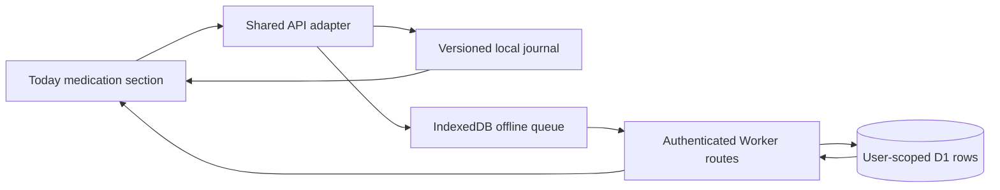

## Context

Calorie is a local-first React app with mirrored browser-storage and
authenticated Worker/D1 paths. It already has a manifest, icons, service
worker, cached shell, and offline write queue. The app shell has a permanent
Online/Offline badge beside the avatar, light-only tokens, and no install
control. Profiles store one optional manual calorie center, while the visible
product principle says goals should use ranges.

Medication names are sensitive journal data. The new tracker must follow the
same user isolation and cache-clearing rules as food, water, and weight without
offering dosage, reminder, interaction, or medical guidance.

## Goals / Non-Goals

**Goals:**

- Make calorie guidance relative to each profile’s estimated maintenance and
  represent both calculated and manual goals as ranges.
- Add a fast daily medication checklist beside Water with private local/cloud
  persistence and offline retry.
- Preserve the established bright botanical identity in an explicitly composed
  dark appearance.
- Remove persistent online chrome while keeping an offline-only recovery cue.
- Expose and verify the installability that the existing PWA foundation
  already supports.

**Non-Goals:**

- Medication dosage, prescribing, drug-interaction checks, notifications, or
  adherence claims.
- Multiple doses of one medication in one day; each definition represents one
  daily Morning, Evening, or Either check-off.
- Wearable or health-platform synchronization.
- Running the D1 migration, deploying, or changing production data.
- Replacing Calorie’s visual language.

## Decisions

1. **Use percentage bands rather than fixed calorie deltas.** Gradual loss is
   80–85% of maintenance, faster loss 75–80%, maintenance 95–105%, and gradual
   gain 105–110%. The automatic lower bound remains 1,200 kcal. The midpoint is
   retained only as an internal progress/fibre reference; all user-facing goal
   math uses the range and its signed adjustment range.

2. **Store manual lower and upper bounds.** `manualCalorieRange` replaces the
   single manual center in the shared profile contract. Local and cloud readers
   translate a legacy `manualCalorieTarget` into ±100 kcal bounds. A D1
   migration adds nullable min/max columns and backfills them from the legacy
   center; the old column remains for rollback compatibility.

3. **Treat medication definitions and daily check-offs as separate data.**
   Definitions contain id, name, schedule, creation time, and optional archive
   time. Check-offs contain a client-generated id, medication id, local
   `takenOn` date, and timestamp, unique per user/medicine/date. Archiving hides
   a medicine from future Today lists without destroying earlier check-offs.

4. **Keep Today optimistic.** Adding/editing/archiving medication and toggling
   today’s check-off updates the dashboard immediately. Cloud writes use the
   existing client-generated id and retry queue. Server queries always include
   the authenticated `user_id`.

5. **Preserve-mode dark appearance.** A device-scoped `system | light | dark`
   setting controls `data-theme` on the root. Semantic tokens remap canvas,
   elevated surfaces, ink, lines, focus, and brand accents; dark mode uses a
   deep leaf canvas and separately composed elevation, not filters or inversion.
   The selector lives in Settings so the app shell stays quiet.

6. **Show connectivity only when actionable.** The permanent header badge is
   removed. When offline, a compact status row below the header explains that
   local changes remain available and cloud writes will retry.

7. **Harden, do not duplicate, the PWA.** Keep the manifest/service worker
   architecture, add light/dark theme metadata, bump the shell cache, remove
   nonfunctional shortcuts, and show an Install Calorie control only when the
   browser provides `beforeinstallprompt`. Standalone mode reports Installed;
   unsupported browsers point to their browser menu.

## Risks / Trade-offs

- **Medication data is sensitive** → Scope every cloud query by user, keep auth
  routes network-only, clear private caches on sign-out, and never log medicine
  names.
- **Offline create then check-off can reorder writes** → Queue definition
  creation before its check-off and use stable client ids for both.
- **A percentage band can still be unsuitable clinically** → Keep the
  informational disclaimer, editable manual range, and 1,200 kcal automatic
  floor.
- **Dark colors can flatten hierarchy** → Use explicit surface tiers and verify
  computed contrast and focus states at mobile, tablet, and desktop widths.
- **Install prompts vary by browser** → Treat the prompt as progressive
  enhancement; manifest/service-worker installability remains the source of
  truth.

## Migration Plan

1. Add the D1 migration for manual calorie bounds and medication tables without
   applying it.
2. Land backward-compatible readers before writers depend on new fields.
3. Validate local-mode migration from the existing storage version.
4. Run local Worker migration/tests only if the repo’s local D1 path is
   available; do not touch remote D1.
5. Rollback can read the retained legacy manual target and ignore the new
   medication tables.

## Open Questions

None.
