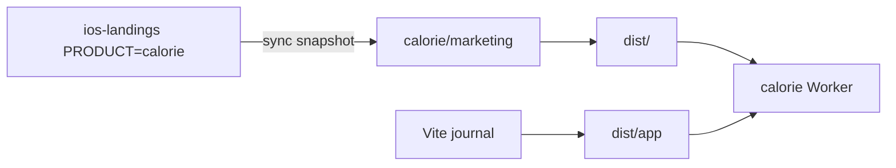

# Design

`ios-landings` remains the landing source. Because that repo is private
and Calorie is public, Calorie vendors a static snapshot at
`marketing/` instead of importing Astro at build time.

`/api/*` stays on the Worker. `/app` and `/app/*` are rewritten to
`/app/index.html` except hashed assets. Everything else is static
assets, including the landing.

Google `callbackURL` becomes `{origin}/app/`.
